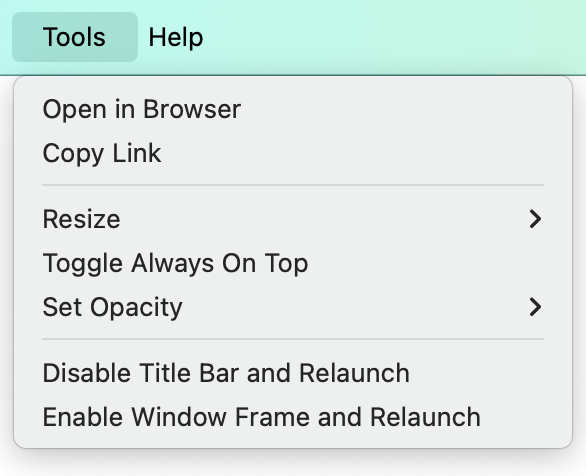
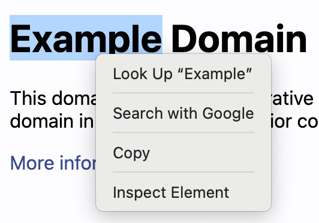

# Tron

> Launch Electron windows from the command line

```sh
npx @kidonng/tron example.com
```

## Usage

```sh
npx @kidonng/tron [options] <url>
```

Options are treated as [`BaseWindowConstructorOptions`](https://www.electronjs.org/docs/latest/api/structures/base-window-options).

| Tools Menu                           | Context Menu                             |
|--------------------------------------|------------------------------------------|
|  |  |

## Examples

Specify window size:

```sh
npx @kidonng/tron --width=1024 --height=768 example.com
```

Disable window frame:

```sh
# Use --no-option to disable an option
# https://github.com/yargs/yargs/blob/main/docs/tricks.md#negating-boolean-arguments
npx @kidonng/tron --no-frame example.com
```

Always on top:

```sh
# Use -- to avoid URL being parsed as option value
# https://github.com/yargs/yargs/blob/main/docs/tricks.md#stop-parsing
npx @kidonng/tron --always-on-top -- example.com
```

## Tips & Tricks

- The URL's protocol (`https://`) is optional.
- Browsing data is partitioned based on the URL's host.
- On macOS, frameless windows can be dragged via [a global shortcut](https://github.com/mathiasbynens/dotfiles/issues/828).

## See Also

- [broz](https://github.com/antfu/broz) - inspired this project
